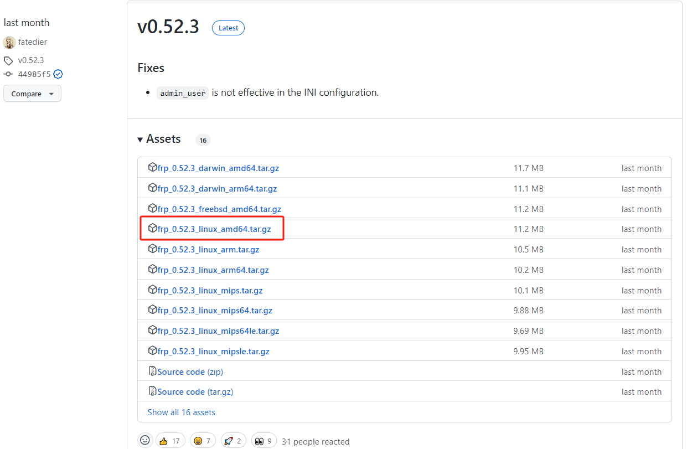

# z2pro Bitwarden + Frp + Nginx教程

> 本案例仅供记录
>
> 使用时按照自己的`IP`和`端口`进行 <font color = red >灵活变通</font>
>
> 本案例中使用的设备：
>
> 1. NAS：z2pro
> 2. 域名：est.xyz
> 3. 云服务器：腾讯云（公网ip：43.43.43.143）

## 一，Vaultwarden

> 本人是在极空间z2pro上进行docker部署的
>
> **官方镜像的totp需要付费使用，vaultwarden镜像 解锁了 bitwarden的totp功能，所以推荐使用vaultwarden**
>
> pc设备安装docker后同理
>
> 云服务器安装docker后同理
>
> 即：
>
> 192.168.1.10:7000 = bitwarden

### 框架图：


### 预期结果：


### 步骤：

1. NAS中安装镜像`vaultwarden`

   

2. 端口设置中,80端口对应`7000`<font color = red>本案例中设置为7000,按照自己的需求更改即可</font>

   

3. 文件夹路径中,在本地创建文件夹`docker/bitwarden`

   

4. 启动并测试,访问`192.168.1.10:7000`,<font color = red>本案例中ip为192.168.1.10,在z2pro设置中查看自己的ip</font>

   

## 二，Frp内网穿透

> 通过公网IP访问局域网中的bitwarden服务
>
> 即：
>
> 客户端frpc连接时需要填写服务器frps绑定的监听端口，本案例中服务器frps监听7010端口
>
> 43.43.43.143:7000 -> 192.168.1.10:7000 = bitwarden

### 架构图：


### 预期结果：


### frps步骤:

1. 手动下载官方[fatedier/frp](https://github.com/fatedier/frp/releases)安装包

   

2. 用你们的SSH工具把他上传到云服务器上,使用`tar -zxvf 文件名.tar.gz`命令解压,结果如下:

   

3. 进入到文件夹后看到下图,我们需要修改`frps.toml`文件:

   

4. 使用`vim frps.toml`命令:

   ```c++
   bindPort = 7010 #服务器监听端口,这个端口很重要,客户端中需要填写这个
   
   webServer.addr = "0.0.0.0" #以下四行为服务器端控制面板的访问地址和端口43.43.43.143:7500,用户名和密码,可以不设置
   webServer.port = 7500  
   webServer.user = "admin"
   webServer.password = "admin"
   ```

5. 结果如图:

   

6. 去云服务器中开放对应端口,bitwarden端口7000,frps监听端口7010,frps的控制面板访问端口7500:

   

7. 启动服务:

   ```c++
   nohup ./frps -c ./frps.toml >frp.log 2>&1 &
   ```

8. 访问管理面板`43.43.43.143:7500`:

   

   

### frpc步骤：

1. docker下载镜像`snowdreamtech/frpc`

   

2. 本地创建文件夹`docker/frpc`

   

3. 在文件夹中创建文件`frpc.txt`,打开编辑<font color=red>先是txt,然后修改后缀为toml,跟着做即可</font>

   ```c++
   # frpc.toml
   serverAddr = "43.43.43.143" #本案例中填写43.43.43.143,修改为你的公网ip地址
   serverPort = 7010 #填写服务器绑定的监听端口，本案例中填写7010端口，按照你的实际情况修改
   
   webServer.addr = "0.0.0.0" #以下四行 为开启客户端控制面板，用户名和密码为admin，访问本地7400端口即可，可以不写
   webServer.port = 7400 
   webServer.user = "admin"
   webServer.password = "admin"
   
   [[proxies]]
   name = "bitwarden"
   type = "tcp"
       
   localIP = "192.168.1.10" #本案例中，bitwarden服务器地址为192.168.1.0，按照你的实际情况修改
   localPort = 7000 #本案例中，bitwarden服务器端口为7000，按照你的实际情况修改
       
   remotePort = 7000 #本案例中，想通过云服务器的7000端口访问，按照你的实际情况修改
       
   transport.useEncryption = true #开启加密，建议开启
   transport.useCompression = true #开启压缩，建议开启
   ```

   > 怕读者混乱，这里重新说下配置文件
   >
   > 43.43.43.143:2000 -> 192.168.1.10:7000
   >
   > serverAddr:remotePort -> localIP:localPort
   >
   > 
   >
   > serverAddr = "43.43.43.143"，填写服务器的地址
   >
   > serevrPort = “ ”，填写服务器的监听端口
   >
   > localIP = "192.168.1.10"，填写客户端的地址
   >
   > localPort = "7000"，填写客户端的端口
   >
   > remotePort = “2000”，填写服务器的端口

4. 修改后缀为`toml`,保存,在创建容器中选择文件夹路径,装载路径为`/etc/frp/frpc.toml`,文件选择刚才我们保存的配置文件`docker/frpc/frpc.toml`

   

5. 启动容器,观察日志,`访问43.43.43.7000`端口,:

   

## 三，nginx反向代理

> 目前已经可以通过公网IP访问局域网的bitwarden服务了
>
> 现在实现域名访问，我们已有域名test.xyz
>
> 即：
>
> bitwarden.test.xyz   = 43.43.43.43:7000
>
> <font color = red>为什么要用子域名，因为我一个服务器上有好几个服务，不同子域名对应不同服务</font>
>
> 例如：
>
> bitwarden.test.xyz 对应 bitwarden
>
> halo.test.xyz 对应 halo博客

### 架构图


### 预期结果


### 子域名解析到服务器（云解析DNS）

1. 进入腾讯云，搜索栏搜索`云解析DNS`

   

2. 点击域名`test.xyz`,添加解析:

   

   >子域名bitwarden.test.xyz
   >
   >主机记录填写:bitwarden <font color=red>本案例中是bitwarden,改成你想要的子域名前缀</font>
   >
   >记录值填写:43.43.43.143 <font color=red>本案例中是43.43.43.143,改成你的服务器公网IP</font>

### 给子域名申请SSL证书（SSL证书）

1. 进入腾讯云，搜索栏搜索`SSL证书`

   

2. 点击`我的证书`,点击`申请免费证书`

   

3. 选择右边的`免费证书`

   

   > 证书绑定域名: bitwarden.test.xyz <font color=red>填写你的子域名</font>
   >
   > 验证方式:选<font color=red>自动DNS验证</font>,因为我这里是<font color=red>测试的域名,不是我的腾讯云域名</font>,所以不让我选择自动DNS验证

4. 申请完成后,需要等待一段时间,<font color=red>通常10分钟以内</font>

5. 申请完成后,下载证书,点击右侧下载,我们下载`nginx`版的

   

6. 使用你的SSH工具将证书上传到腾讯云服务器

   > 这里为什么不重点说呢,因为每个人上传的方法不一样,
   >
   > 有的使用SSH工具就能上传,有的通过SSH的scp命令上传,总之上传上去就行

### 云服务器安装nginx

> 特别简洁的官方教程:https://ubuntu.com/tutorials/install-and-configure-nginx#2-installing-nginx

1. ubuntu中安装nginx

   ```c++
   sudo apt update
   sudo apt install nginx
   ```

2. 访问`43.43.43.143`<font color =red>直接截的官方图,效果一样</font>

   

3. nginx的配置文件在`/etc/nginx/`文件夹下,进入这个文件夹

   > nginx的配置文件在/etc/nginx下,不要乱找
   >
   > 配置文件为:<font color=red>nginx.conf</font>

   

4. 将SSL证书放到文件夹中

   1. 在/etc/nginx中创建文件夹`tls/bitwarden`,用来存放bitwarden子域名的证书

      > tls文件夹是本人创建专门分类服务器证书的,如果路径你们不觉得乱,也可以不管
      >
      > 例如:
      >
      > 创建文件夹`tls/halo`,用来存放halo子域名的证书
      >
      > 创建文件夹`tls/https`,用来存放https子域名的证书

   2. 在云服务器上解压你的证书压缩包

      > zip包用 unzip
      >
      > tar.gz包,用tar -zxvf

   3. 将解压好的证书包里面的四个文件,移动到`tls/bitwarden`中

      > sudo mv bitwarden* /etc/nginx/tls/bitwarden

   4. 结果应该是如下:

      

5. 修改nginx配置文件`nginx.conf`

   > bitwarden.test.xyz     访问  http://43.43.43.143:7000
   >
   > server_name:listen    访问     proxy_pass
   >
   > 即:
   >
   > server_name:bitwarden.test.xyz
   >
   > listen:443
   >
   > proxy_pass http://43.43.43.143:7000

   nginx配置文件整体框架如下:

   ```c++
   全局块
   events{
   }
   http{
       #我们写的东西要放在这里面
   }
   ```

   添加配置快:

   ```c++
       #HTTP服务器
       server {
       #监听443端口。443为知名端口号，主要用于HTTPS协议
       listen       443 ssl;
   
       #定义使用www.xx.com访问
       server_name  bitwarden.test.xyz;
   
       #ssl证书文件位置
       ssl_certificate      /etc/nginx/tls/bitwarden/bitwarden.test.xyz_bundle.crt;
       #ssl证书key位置
       ssl_certificate_key  /etc/nginx/tls/bitwarden/bitwarden.test.xyz.key;
   
       #ssl配置参数（选择性配置）
       ssl_session_cache    shared:SSL:1m;
       ssl_session_timeout  5m;
       #数字签名，此处使用MD5
       ssl_ciphers  HIGH:!aNULL:!MD5;
       ssl_prefer_server_ciphers  on;
       location / {
          proxy_pass http://43.43.43.143:7000;
          root   /root;
          index  index.html index.htm;
        }
       }
   ```

   将`配置块`添加到`http下面`,添加完成后的配置文件:<font color=red>不是完整的配置文件,只是告诉你放在哪里,放对了就没问题</font>

   ```c++
   全局块
   events{
   }
   http{
       #我们写的东西要放在这里面
       #HTTP服务器
       server {
       #监听443端口。443为知名端口号，主要用于HTTPS协议
       listen       443 ssl;
   
       #定义使用www.xx.com访问
       server_name  bitwarden.test.xyz;
   
       #ssl证书文件位置
       ssl_certificate      /etc/nginx/tls/bitwarden/bitwarden.test.xyz_bundle.crt;
       #ssl证书key位置
       ssl_certificate_key  /etc/nginx/tls/bitwarden/bitwarden.test.xyz.key;
   
       #ssl配置参数（选择性配置）
       ssl_session_cache    shared:SSL:1m;
       ssl_session_timeout  5m;
       #数字签名，此处使用MD5
       ssl_ciphers  HIGH:!aNULL:!MD5;
       ssl_prefer_server_ciphers  on;
       location / {
          proxy_pass http://43.43.43.143:7000;
          root   /root;
          index  index.html index.htm;
        }
       }
   }
   ```

6. 测试nginx配置文件

   ```c++
   sudo nginx -t
   ```

7. 后台启动nginx服务

   ~~~c++
   nohup sudo service nginx restart > nginx.log 2&>1 &
   ~~~

### 测试结果

​	

