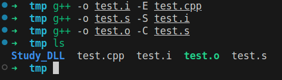
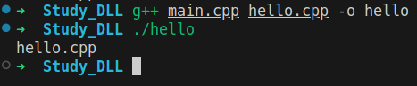
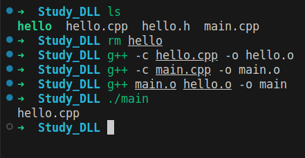
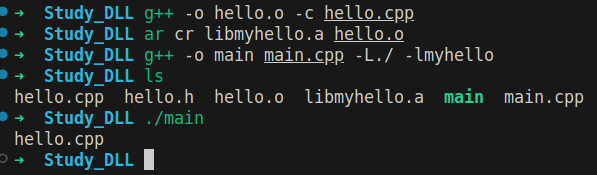
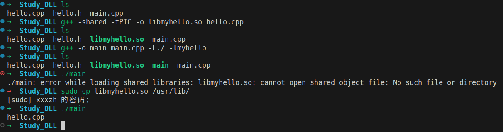

### 文件编译流程

### 一次性编译多个文件

### 依次编译

### 编译静态链接库(.a)

> 将静态链接库编译成二进制文件**（必须的）**
>
> 然后生成为静态链接库
>
> 编译主函数时，链接静态链接库
>
> **注意，gcc会在静态库名前加上前缀lib，然后追加扩展名.a得到的静态库文件名来查找静态库文件**
>
> ** 后面两个二进制文件，合并成一个**

-L 表示引用库的参数

-l 表示引用库文件名

### 编译动态链接库

> 直接将.cpp 文件生成动态链接库
>
> 编译文件直接使用
>
> 可以同时将多个文件编译到一起
>
>  g++ one.cpp two.cpp three.cpp -fPIC -shared -o libtest.so

### 静态库和动态库同名时，优先使用动态库

